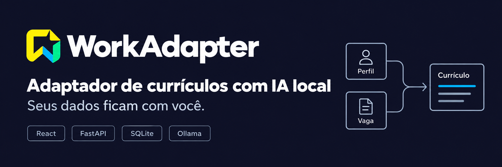
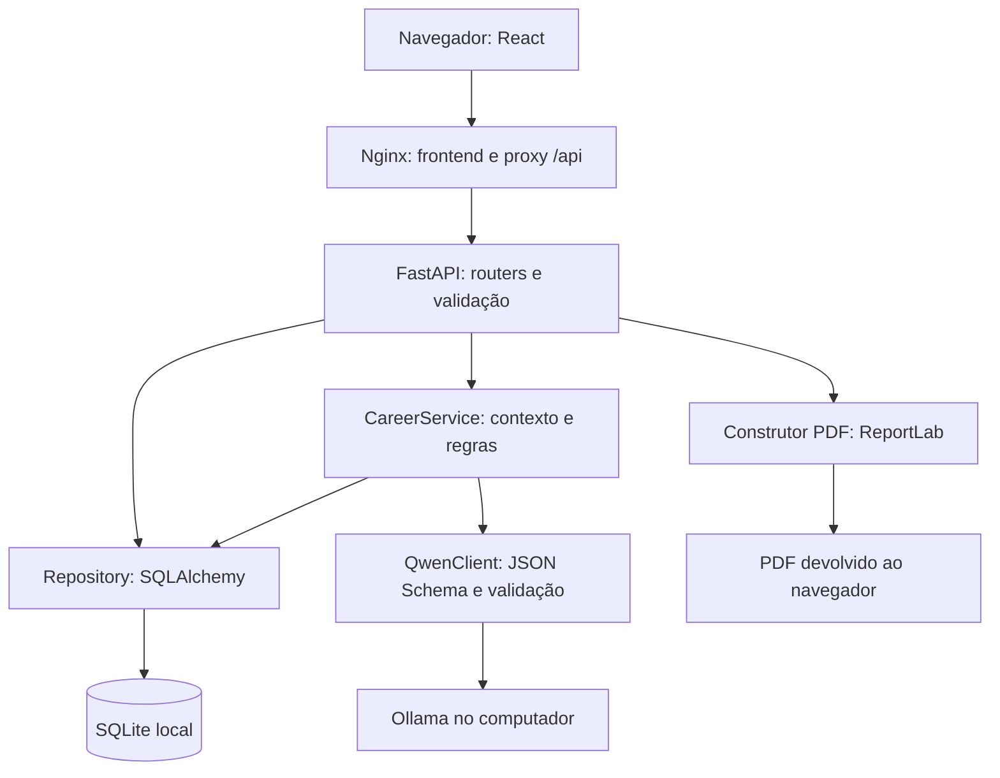
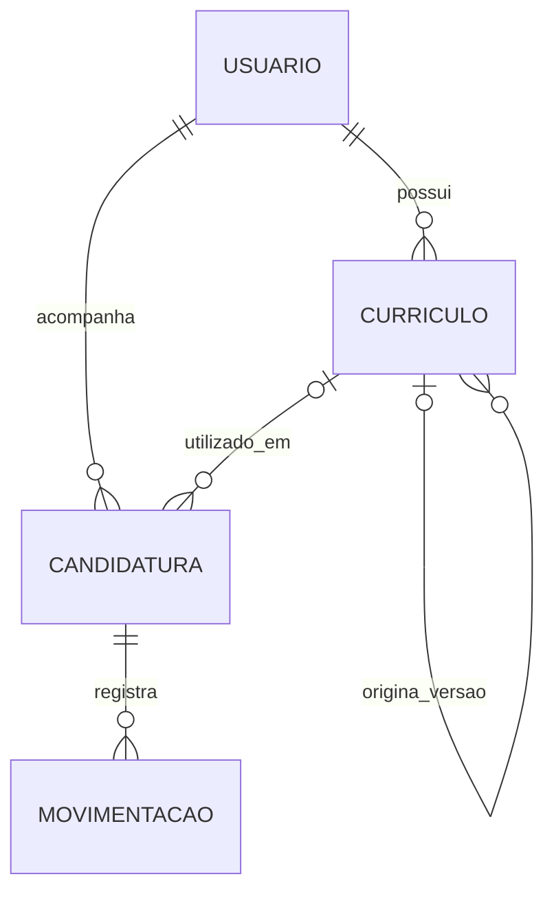
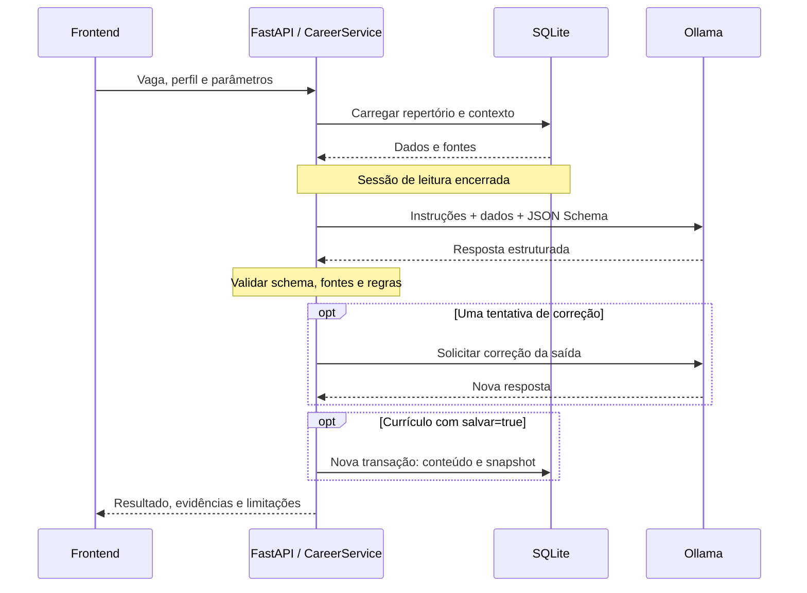

<!--
BANNER DO PROJETO
Coloque a imagem em ./banner.png, ao lado deste README.md.
A estrutura atual do projeto já prevê banner.png e logo.png na raiz.
Se mudar o local, ajuste src abaixo. Sugestão visual: banner horizontal de 1500 × 500 px.
-->
<p align="center">
  
</p>

<h1 align="center">WorkAdapter</h1>
<p align="center"><strong>Seu repertório profissional, adaptado para cada oportunidade.</strong><br/>Currículos, candidaturas e planejamento de carreira com inteligência artificial local.</p>

<p align="center">
  <a href="https://react.dev/"></a>
  <a href="https://vite.dev/"></a>
  <a href="https://developer.mozilla.org/docs/Web/JavaScript"></a>
  <a href="https://www.python.org/"></a>
  <a href="https://fastapi.tiangolo.com/"></a>
</p>
<p align="center">
  <a href="https://www.sqlalchemy.org/"></a>
  <a href="https://www.sqlite.org/"></a>
  <a href="https://docs.pydantic.dev/"></a>
  <a href="https://ollama.com/"></a>
  <a href="https://ollama.com/library/qwen3"></a>
</p>
<p align="center">
  <a href="https://www.reportlab.com/"></a>
  <a href="https://www.docker.com/"></a>
  <a href="https://nginx.org/"></a>
  
</p>

<p align="center">
  <a href="#visao-geral">Sobre</a> ·
  <a href="#instalacao">Instalação</a> ·
  <a href="#manual">Manual</a> ·
  <a href="#arquitetura">Arquitetura</a> ·
  <a href="#rotas">API</a> ·
  <a href="#modelos">Modelos de IA</a> ·
  <a href="#contribuicao">Contribuir</a>
</p>

> **Estado do projeto:** aplicação pessoal em desenvolvimento, com execução local. As análises são sugestões que exigem revisão humana; o match não representa chance de contratação. A API atual não possui autenticação e não foi preparada para exposição pública.

## Sumário

1. [Visão geral e escopo](#visao-geral)
2. [Funcionalidades e persistência](#funcionalidades)
3. [Stack e identidade visual](#stack)
4. [Arquitetura e decisões](#arquitetura)
5. [Estrutura de pastas](#estrutura)
6. [Modelo de dados e regras de domínio](#dados)
7. [Modelos locais, hardware e trade-offs](#modelos)
8. [Instalação e execução](#instalacao)
9. [Configuração e variáveis de ambiente](#configuracao)
10. [Manual de uso](#manual)
11. [Arquitetura e catálogo de rotas](#rotas)
12. [Exemplos de API](#exemplos)
13. [Como a IA funciona](#pipeline-ia)
14. [Como o match é calculado](#match)
15. [Construção de PDF](#pdf)
16. [Privacidade, segurança e limites](#privacidade)
17. [Testes e validação](#testes)
18. [Operação, backups e atualização](#operacao)
19. [Resolução de problemas](#problemas)
20. [Guia de contribuição](#contribuicao)
21. [Evoluções possíveis](#roadmap)
22. [Documentação, licença e créditos](#referencias)

<a id="visao-geral"></a>
## 1. Visão geral

O **WorkAdapter** organiza informações profissionais e usa um modelo de linguagem executado no computador do usuário para adaptar currículos a descrições de vagas. O projeto reúne cadastro de perfil, versões de currículos, acompanhamento de candidaturas e análises de carreira em uma interface única.

A proposta é evitar que cada candidatura comece do zero: o usuário cadastra seu repertório uma vez, informa os requisitos de uma oportunidade e recebe uma versão direcionada para revisar. A adaptação deve selecionar e apresentar melhor informações existentes, sem criar qualificações inexistentes.

O fluxo principal é:

1. Cadastrar experiências, formação, cursos, projetos, habilidades e idiomas.
2. Informar uma vaga nova ou selecionar uma candidatura salva.
3. Solicitar uma adaptação com o Qwen pelo Ollama local.
4. Revisar o currículo, as alterações e os requisitos sem evidência.
5. Baixar o PDF e escolher a versão usada na candidatura.
6. Registrar as etapas do processo e explorar recomendações de estudo.

### O que o projeto não faz atualmente

- Não envia candidaturas nem mensagens para recrutadores.
- Não busca vagas em tempo real nem faz scraping de plataformas.
- Não consulta algoritmos internos de ATS ou sistemas de recrutamento.
- Não importa automaticamente currículos PDF/DOCX existentes.
- Não treina ou faz fine-tuning do modelo com os cadastros.
- Não possui contas autenticadas, login, cobrança ou sincronização em nuvem.
- Não implementa RAG com banco vetorial: o contexto vem do SQLite e é montado diretamente para cada solicitação.

<a id="funcionalidades"></a>
## 2. Funcionalidades e persistência

| Área | Recursos implementados | Onde ficam os dados |
| --- | --- | --- |
| Perfil | Dados pessoais, objetivo atual e resumo profissional | SQLite |
| Repertório | Experiências, formação, cursos, projetos e idiomas | SQLite |
| Habilidades | Catálogo, nível pessoal e stacks vinculadas aos itens | SQLite |
| Currículos | Cadastro manual, geração com IA, consulta, edição, versões e exclusão protegida | Conteúdo JSON no SQLite |
| PDF | Visualização e download do currículo salvo | Gerado em memória; download no navegador |
| Candidaturas | Empresa, vaga, descrição, plataforma, contrato, modalidade, datas, status, etapa e currículo utilizado | SQLite |
| Histórico | Registro de movimentações e atualização da situação atual | SQLite |
| Análise de perfil | Resumo, pontos fortes, cargos sugeridos, evidências e limitações | Resposta da API; estado em memória no frontend |
| Match | Critérios, pesos, aderência estimada, evidências e pendências | Resposta da API; estado em memória no frontend |
| Estudos | Plano por objetivo, tempo disponível e amostra das candidaturas | Resposta da API; estado em memória no frontend |

**Persistência importante:** navegar entre abas mantém as análises da sessão. Recarregar a página ou trocar o perfil apaga as análises não persistidas. Currículos gerados pela interface são salvos no banco. Na API, salvar é opcional e depende de `salvar: true`.

<a id="stack"></a>
## 3. Stack e identidade visual

| Camada | Tecnologia | Responsabilidade |
| --- | --- | --- |
| Interface | React 19 e JavaScript | Componentes, formulários, estados e navegação |
| Build | Vite 7 | Desenvolvimento local e compilação do frontend |
| Estilos | CSS próprio | Layout responsivo, painéis glass e feedback visual |
| HTTP no navegador | Fetch API | Comunicação com FastAPI e download binário de PDF |
| API | FastAPI e Uvicorn | Rotas REST, ciclo de vida e execução ASGI |
| Contratos | Pydantic 2 | Validação de entrada e de respostas estruturadas da IA |
| Persistência | SQLAlchemy 2.0 e SQLite | ORM, transações, relacionamentos e arquivo local |
| Inferência | Ollama e Qwen3:8b | Execução do modelo local e geração estruturada |
| Cliente do modelo | Biblioteca `ollama` e HTTPX | Chamadas, limites de conexão e timeout |
| Documento | ReportLab | Construção de PDF com texto selecionável |
| Testes Python | unittest, TestClient e pypdf | Regras, integração e inspeção de PDF |
| Execução empacotada | Docker Compose | Inicialização coordenada de frontend e backend |
| Frontend compilado | Nginx | Arquivos estáticos e proxy de `/api/` |

Não são necessários React Router, Redux ou uma biblioteca de componentes para executar a interface atual. A navegação usa fragmentos de URL, como `#perfil` e `#assistente`.

### Paleta

| Cor | Uso na identidade |
| --- | --- |
| `#FFF000` | Ações principais e destaque |
| `#00FF79` | Feedback positivo e acentos |
| `#00B7FF` | Elementos informativos e interação |
| `#1B1159` | Superfícies e profundidade |
| `#101126` | Fundo principal |

A interface utiliza rótulos persistentes, foco visível, mensagens de erro, estados de espera, confirmação de exclusão, diálogo nativo e adaptação a telas menores. Esses cuidados são decisões de usabilidade; não equivalem a uma certificação formal de acessibilidade.

### Banner, logo e capturas

- **Banner:** coloque `banner.png` na raiz. O cabeçalho deste README já aponta para `./banner.png`.
- **Logo:** mantenha `logo.png` na raiz, conforme a organização do projeto.
- **Capturas:** uma opção é criar `documentation/screenshots/` com exemplos sem dados pessoais.
- Para mostrar uma captura, adicione `` depois de criar o arquivo.
- As badges são imagens estáticas do [Shields.io](https://shields.io/docs/static-badges); não representam execução de CI ou cobertura de testes.

<a id="arquitetura"></a>
## 4. Arquitetura

O projeto usa uma aplicação React separada de um **backend modular único**. Banco e inferência local são dependências acessadas pelo backend. Ter pastas separadas não transforma os módulos em microsserviços: as rotas, os serviços e o repository são executados no mesmo processo da API.



No desenvolvimento sem Docker, o Vite serve o frontend e o navegador chama o FastAPI diretamente. No Compose, o Nginx serve o build e encaminha `/api/`, sem Vite em execução.

### Decisões e consequências

| Decisão | Motivo | Consequência / limite |
| --- | --- | --- |
| SQLite local | Reduzir serviços, configuração e complexidade para uso pessoal | O arquivo precisa de backup; concorrência intensa não é o objetivo |
| SQLAlchemy + repository | Centralizar consultas e regras de persistência | Rotas não devem espalhar SQL ou commits próprios |
| Pydantic nas bordas | Definir contratos claros e rejeitar campos inesperados | Frontend e API precisam evoluir juntos |
| Rotas por recurso | Localizar responsabilidades e simplificar manutenção | `main_router.py` concentra o registro, não as regras de negócio |
| Serviço separado para IA | Isolar preparação de contexto, inferência e pós-processamento | O modelo não acessa o banco diretamente |
| JSON Schema na inferência | Obter saídas que a aplicação consegue validar e renderizar | JSON válido não garante conteúdo verdadeiro |
| Contatos copiados da base | Evitar que o modelo reescreva dados fixos do currículo | A correção desses dados deve ocorrer no perfil |
| Snapshot do perfil | Registrar a base usada em uma versão do currículo | Atualizar o perfil não atualiza currículos antigos |
| Proteção de currículo vinculado | Preservar o que foi associado a uma candidatura | Mudanças exigem uma nova versão e seleção explícita |
| PDF sob demanda | Evitar arquivos temporários e sincronização com JSON | O documento é reconstruído em cada solicitação |
| Cálculo de match em Python | Tornar pesos e fórmula auditáveis | Os critérios ainda dependem da interpretação do modelo |
| Uma inferência por processo | Evitar disputa desnecessária de memória/GPU | Chamadas simultâneas recebem 503; não há fila durável |
| Ollama fora do Compose | Aproveitar modelos e GPU configurados no host | O serviço Ollama deve ser mantido ativo separadamente |
| Rede `host` no Compose | Acessar Ollama via loopback no Linux | Configuração voltada ao Docker Engine nativo Linux |
| React compilado no Docker | Executar a aplicação sem terminal de desenvolvimento | Mudanças de código exigem rebuild; não há hot reload |
| Ausência de login nesta fase | Foco em uso local e redução de escopo | Perfis separados não representam isolamento de segurança |

### Transações

Nos endpoints CRUD, uma `Session` e uma transação são abertas por requisição. O repository usa `flush` para obter IDs e validar operações, mas o chamador controla o commit. A dependência `Repo` finaliza a transação antes de enviar a resposta.

Nas rotas de IA, o serviço carrega os dados e fecha a sessão antes de iniciar a inferência. Se for necessário salvar um currículo, abre uma nova transação após validar o resultado. Assim, a espera pelo modelo não mantém uma transação SQLite aberta.

<a id="estrutura"></a>
## 5. Estrutura de pastas

A tabela abaixo descreve os caminhos relevantes da implementação. Arquivos de ambiente, banco, `node_modules` e caches são locais e não devem ser versionados. `documentation/`, `public/` e configurações de lint podem conter arquivos adicionais do projeto.

| Caminho | Conteúdo / responsabilidade |
| --- | --- |
| `README.md` | Guia principal do repositório |
| `banner.png` / `logo.png` | Identidade visual |
| `.gitignore` | Exclusões de dados, ambientes e artefatos |
| `compose.yaml` | Serviços e execução pelo Docker Compose |
| `LEIA-ME-DOCKER.md` | Guia específico do pacote Docker |
| `documentation/` | Documentação adicional e possíveis capturas |
| `backend/__init__.py` | Pacote Python do backend |
| `backend/requirements.txt` | Agregador das dependências da API, IA e PDF |
| `backend/requirements-dev.txt` | Dependências adicionais de testes |
| `backend/database/models.py` | Entidades, relacionamentos, enums e criação do banco |
| `backend/database/repository.py` | CRUD, snapshots, versões, vínculos e regras de domínio |
| `backend/database/workadapter.db` | Banco criado em execução; não versionar |
| `backend/api/main_router.py` | Fábrica da aplicação, lifespan, CORS, erros e routers |
| `backend/api/dependencies.py` | Sessão/transação por requisição |
| `backend/api/schemas.py` | Entradas Pydantic para CRUD |
| `backend/api/serialization.py` | Serialização de entidades e stacks |
| `backend/api/routes/usuarios.py` | Usuários e perfil completo |
| `backend/api/routes/experiencias.py` | Experiências e suas stacks |
| `backend/api/routes/formacoes.py` | Formação acadêmica e suas stacks |
| `backend/api/routes/cursos.py` | Cursos e suas stacks |
| `backend/api/routes/projetos.py` | Projetos e suas stacks |
| `backend/api/routes/idiomas.py` | Idiomas, níveis e certificações informadas |
| `backend/api/routes/habilidades.py` | Catálogo e habilidades por usuário |
| `backend/api/routes/curriculos.py` | Currículos e versões |
| `backend/api/routes/candidaturas.py` | Candidaturas e filtros |
| `backend/api/routes/movimentacoes.py` | Histórico do processo seletivo |
| `backend/api/routes/ia.py` | Quatro endpoints do assistente |
| `backend/api/routes/pdf.py` | Download e visualização de PDF |
| `backend/agents/gen_model.py` | Cliente Ollama, parâmetros, lock e erros de IA |
| `backend/agents/context.py` | Fontes, evidências, perfil e histórico para o prompt |
| `backend/agents/schemas.py` | Entradas e saídas estruturadas da IA |
| `backend/agents/services.py` | Orquestração das quatro funcionalidades |
| `backend/agents/.env.example` | Referência das variáveis de IA |
| `backend/agents/tests/test_ia.py` | Testes com respostas controladas do modelo |
| `backend/pdf/constructor.py` | Construção de PDF em memória ou arquivo explícito |
| `backend/pdf/tests/test_constructor.py` | Validação de conteúdo, paginação e rota PDF |
| `frontend/package.json` / `package-lock.json` | Dependências e scripts Node |
| `frontend/vite.config.js` | Configuração do Vite |
| `frontend/.env.example` | Endereço de exemplo da API |
| `frontend/index.html` | Entrada HTML |
| `frontend/src/main.jsx` | Inicialização do React |
| `frontend/src/App.jsx` | Navegação, perfil ativo, carregamento e notificações |
| `frontend/src/config.js` | Campos, status e rótulos |
| `frontend/src/index.css` | Estilos globais, componentes e responsividade |
| `frontend/src/services/api.js` | Fetch, paginação, erros e PDF binário |
| `frontend/src/components/UI.jsx` | Componentes compartilhados e formulários |
| `frontend/src/components/ResumeDocument.jsx` | Documento, editor estruturado e ações PDF |
| `frontend/src/pages/Overview.jsx` | Visão geral |
| `frontend/src/pages/Profile.jsx` | Cadastro do repertório |
| `frontend/src/pages/Resumes.jsx` | Currículos e versões |
| `frontend/src/pages/Applications.jsx` | Gerenciamento de candidaturas |
| `frontend/src/pages/Assistant.jsx` | Formulários e resultados de IA |
| `docker/Dockerfile.api` | Imagem do backend Python |
| `docker/Dockerfile.web` | Build Node e imagem Nginx |
| `docker/nginx.conf` | Frontend estático e proxy com timeout de IA |
| `docker/Dockerfile.api.dockerignore` | Exclusões do contexto de build da API |
| `docker/Dockerfile.web.dockerignore` | Exclusões do contexto de build do frontend |

<a id="dados"></a>
## 6. Modelo de dados

O schema contém **15 tabelas**: 11 entidades/tabelas principais e quatro associações de stacks.

| Tabela | Campos / finalidade principais |
| --- | --- |
| `usuarios` | Nome, contato, localização, links, resumo e vaga alvo atual |
| `experiencias` | Cargo, empresa, vínculo, localidade, datas, situação atual, descrição e resultados |
| `formacoes` | Instituição, curso, nível, status, datas e descrição |
| `cursos` | Nome, instituição, carga horária, status, datas, descrição e certificado |
| `projetos` | Nome, papel, descrição, resultados, datas, repositório e demonstração |
| `idiomas_usuario` | Idioma, nível informado, certificação e pontuação |
| `habilidades` | Catálogo de nomes e categorias |
| `usuario_habilidades` | Associação entre usuário e habilidade, com nível pessoal |
| `curriculos` | Alvo, conteúdo JSON, snapshot, alterações, lacunas, modelos, versão de prompt e origem |
| `candidaturas` | Vaga, empresa, descrição, plataforma, modalidade, contrato, status, etapa e currículo |
| `candidatura_movimentacoes` | Status, etapa, momento e observação de cada evento |
| `experiencia_habilidades` | Stack utilizada em uma experiência |
| `formacao_habilidades` | Stack associada à formação |
| `curso_habilidades` | Stack associada a um curso |
| `projeto_habilidades` | Stack associada a um projeto |

### Relacionamentos principais



Cada item de repertório pertence a um usuário. As stacks usam relações muitos-para-muitos com o catálogo de habilidades. Uma habilidade mencionada em um curso não implica automaticamente domínio profissional: essa interpretação exige contexto e revisão.

### Regras importantes

- Chaves estrangeiras são habilitadas por conexão SQLite (`PRAGMA foreign_keys=ON`).
- Associações de stacks usam chaves compostas para evitar vínculos repetidos.
- Datas finais não podem preceder datas iniciais; carga horária não pode ser negativa.
- O repository verifica se registros solicitados pertencem ao usuário indicado na rota.
- Um currículo vinculado a candidatura não pode ser editado ou excluído pelo repository; crie outra versão.
- A nova versão guarda `curriculo_origem_id` e preserva o snapshot original, salvo quando outro snapshot é fornecido explicitamente.
- Atualizar o perfil não altera automaticamente currículos ou snapshots já existentes.
- Alterar o currículo usado em uma candidatura é uma ação explícita.
- Excluir uma candidatura remove seu histórico, mas mantém o currículo.
- Excluir um usuário remove seus dados dependentes; essa operação existe na API.
- Habilidades com vínculos não podem ser excluídas do catálogo pelo repository.
- `PUT .../habilidades` de um item **substitui toda a stack**; `[]` remove seus vínculos.
- Uma movimentação antiga não deve sobrescrever a situação de uma movimentação mais recente.

`Base.metadata.create_all()` cria tabelas ausentes, mas **não migra tabelas existentes**. Alterações de schema exigem planejamento de migração; Alembic ainda não está integrado.

<a id="modelos"></a>
## 7. Modelos locais, hardware e trade-offs

### Modelo utilizado

O padrão do backend é **`qwen3:8b`**, executado pelo Ollama local. O cliente solicita JSON Schema, usa `think=False`, temperatura `0`, `stream=False` e mantém o modelo carregado por até `5m` após uma chamada, conforme a política do Ollama.

O projeto foi desenhado em torno dos contratos desse fluxo. **`tev1:0.8b` não participa da implementação atual**; não há classificador separado ou coordenação entre dois modelos nas rotas entregues.

### Opções para outras máquinas

Os tamanhos aproximados abaixo correspondem às tags consultadas no [catálogo Qwen3 do Ollama](https://ollama.com/library/qwen3). Tags e quantizações podem mudar. **Tamanho do download não é consumo total de RAM/VRAM:** contexto, cache, runtime e demais aplicativos também ocupam memória.

As faixas de RAM são orientações conservadoras de planejamento, não requisitos oficiais nem medições deste projeto. Os trade-offs são expectativas a validar com as mesmas vagas e perfis; não houve benchmark comparativo dessas alternativas no WorkAdapter.

<table>
  <thead>
    <tr>
      <th>Modelo / tag</th>
      <th>Download aproximado</th>
      <th>Máquina para considerar</th>
      <th>Possível benefício</th>
      <th>Trade-offs e cautelas</th>
      <th>Status no projeto</th>
    </tr>
  </thead>
  <tbody>
    <tr>
      <td><code>qwen3:0.6b</code></td>
      <td>523 MB</td>
      <td>PC muito limitado; partir de cerca de 8 GB de RAM total para o conjunto desktop/aplicação.</td>
      <td>Menor tamanho e custo de inferência; útil para experimentar o fluxo.</td>
      <td>Maior risco esperado de respostas superficiais, perda de contexto e falhas semânticas em schemas extensos. Não é a escolha preferida para currículo final.</td>
      <td>Alternativa experimental, não validada ponta a ponta.</td>
    </tr>
    <tr>
      <td><code>qwen3:1.7b</code></td>
      <td>1,4 GB</td>
      <td>PC básico com aproximadamente 8–12 GB de RAM; CPU ou GPU com pouca memória.</td>
      <td>Mais capacidade que a opção mínima, com carga reduzida.</td>
      <td>Exige contexto enxuto e revisão rigorosa. Pode omitir evidências ou repetir recomendações genéricas.</td>
      <td>Alternativa experimental.</td>
    </tr>
    <tr>
      <td><code>qwen3:4b</code></td>
      <td>2,5 GB</td>
      <td>Máquina intermediária; aproximadamente 12–16 GB de RAM como ponto de partida.</td>
      <td>Candidato a equilíbrio entre consumo e qualidade para perfis menores.</td>
      <td>Qualidade precisa ser comparada ao 8B; a tag disponível e seu comportamento de thinking devem ser conferidos.</td>
      <td>Primeira alternativa a avaliar se 8B estiver pesado.</td>
    </tr>
    <tr>
      <td><strong><code>qwen3:8b</code></strong></td>
      <td><strong>5,2 GB</strong></td>
      <td>Referência de uso: aproximadamente 16–32 GB de RAM. GPU com 8 GB pode exigir contexto menor ou offload, conforme runtime.</td>
      <td>Modelo padrão para adaptação, análise e saídas estruturadas.</td>
      <td>Mais lento em CPU; contexto de 16K aumenta memória. Não garante que toda a inferência caiba em uma GPU de 8 GB.</td>
      <td><strong>Padrão integrado.</strong></td>
    </tr>
    <tr>
      <td><code>qwen3:14b</code></td>
      <td>9,3 GB</td>
      <td>Máquina mais forte; cerca de 32 GB de RAM e, preferencialmente, GPU com mais memória.</td>
      <td>Mais capacidade potencial para nuances e síntese de repertórios extensos.</td>
      <td>Maior uso de memória e latência; não garante melhor aderência às evidências sem avaliação.</td>
      <td>Alternativa experimental de maior capacidade.</td>
    </tr>
    <tr>
      <td><code>qwen3:32b</code></td>
      <td>20 GB</td>
      <td>Workstation; planejar aproximadamente 64 GB de RAM ou configuração acelerada com memória suficiente.</td>
      <td>Exploração de análises mais exigentes em hardware adequado.</td>
      <td>Download, memória e tempo elevados. Uma GPU com 24 GB pode ficar apertada dependendo do contexto e do overhead.</td>
      <td>Opcional; sem benchmark neste projeto.</td>
    </tr>
  </tbody>
</table>

**Não confunda RAM com VRAM.** Uma máquina pode carregar parte do modelo em CPU e parte em GPU. Mais RAM não substitui automaticamente a velocidade da GPU; uma placa presente também não significa que o Ollama está usando sua aceleração.

Confira o uso durante uma análise:

```bash
ollama list
ollama ps
```

A coluna de processamento do Ollama ajuda a observar o offload. Suporte de GPU depende do modelo de placa, driver, sistema operacional e versão do runtime: consulte a [documentação de GPU](https://docs.ollama.com/gpu). O projeto não inclui configuração ROCm/CUDA dentro de containers.

### Trocar o modelo sem Docker

```bash
ollama pull qwen3:4b

# No terminal da API, com a venv ativa:
export QWEN_MODEL=qwen3:4b
export QWEN_NUM_CTX=8192
export QWEN_NUM_PREDICT=2048
export QWEN_MAX_INPUT_CHARS=10000
python -m uvicorn backend.api.main_router:app --reload
```

Esse perfil reduz o orçamento de contexto, mas pode rejeitar cadastros maiores e limitar a saída. Não é um ajuste universal. O cliente exige `QWEN_NUM_CTX >= 8192`, `QWEN_NUM_PREDICT >= 1024` e saída menor que o contexto.

### Trocar no Docker Compose

Baixe o modelo no **host**, edite `services.backend.environment` no `compose.yaml` e recrie a API:

```yaml
QWEN_MODEL: qwen3:4b
QWEN_NUM_CTX: "8192"
QWEN_NUM_PREDICT: "2048"
QWEN_MAX_INPUT_CHARS: "10000"
```

```bash
ollama pull qwen3:4b
sudo env LOCAL_UID="$(id -u)" LOCAL_GID="$(id -g)" \
  docker compose up -d --force-recreate backend
```

No Compose atual, esses valores estão explícitos no YAML: exportar `QWEN_MODEL` no terminal não os substitui. Alterar ambiente exige recriar o container; `restart` sozinho não aplica nova configuração.

Para experimentar famílias diferentes, verifique compatibilidade com JSON Schema, `think=False`, idioma e tamanho de saída. Apenas trocar o nome do modelo não garante qualidade ou compatibilidade.

<a id="instalacao"></a>
## 8. Instalação e execução

### Pré-requisitos

| Modo | Necessário |
| --- | --- |
| Com Docker | Docker Engine e plugin Compose; Ollama instalado no host; modelo baixado |
| Desenvolvimento manual | Python 3.12, venv, Node.js 22.12+ na linha 22 ou versão compatível com Vite 7, npm e Ollama |
| Ambos | Código completo, espaço para dependências/modelos e acesso de gravação ao banco |

O Docker usa Python 3.12 e Node 22 nas etapas correspondentes. Node compila o frontend; a imagem final do site executa Nginx.

O exemplo abaixo usa `~/Projetos/WorkAdapter`. Ajuste se seu checkout estiver em outro caminho. Para obter o projeto, clone pela URL real deste repositório ou baixe o código pelo GitHub; nenhuma URL de autor foi presumida neste documento.

### 8.1 Preparar o Ollama

Instale o Ollama pelo [site oficial](https://ollama.com/download) e consulte as instruções de [Linux](https://docs.ollama.com/linux) quando necessário.

```bash
ollama --version
ollama pull qwen3:8b
ollama list
```

Se o serviço não estiver ativo, execute `ollama serve` em outro terminal. Se já estiver rodando como serviço, não inicie outra instância. Em instalações com systemd:

```bash
systemctl status ollama
# Somente se estiver parado:
sudo systemctl start ollama
```

### 8.2 Executar com Docker Compose

O Compose fornecido foi pensado para **Docker Engine nativo no Linux**, usando rede `host`. Outros ambientes exigem revisão de rede e suporte específico.

1. Confira a instalação:

```bash
docker --version
docker compose version
```

Se faltar, siga a [instalação oficial no Ubuntu](https://docs.docker.com/engine/install/ubuntu/).

2. Pare os processos antigos de Uvicorn e Vite, se estiverem rodando. Preserve o Ollama.
3. Na raiz do projeto, valide a configuração e inicie:

```bash
cd ~/Projetos/WorkAdapter

sudo env LOCAL_UID="$(id -u)" LOCAL_GID="$(id -g)" docker compose config --quiet
sudo env LOCAL_UID="$(id -u)" LOCAL_GID="$(id -g)" docker compose up -d --build
sudo docker compose ps
```

Se seu usuário já tem acesso ao daemon, pode omitir `sudo env` e usar `LOCAL_UID="$(id -u)" LOCAL_GID="$(id -g)" docker compose up -d --build`.

4. Abra:

| Recurso | Endereço |
| --- | --- |
| Aplicação | http://localhost:8080 |
| Swagger | http://127.0.0.1:8000/docs |
| ReDoc | http://127.0.0.1:8000/redoc |
| OpenAPI JSON | http://127.0.0.1:8000/openapi.json |
| Saúde da API | http://127.0.0.1:8000/health |

A primeira execução baixa imagens, instala dependências e compila o React. O frontend espera a saúde do backend antes de iniciar. O healthcheck verifica a API, não o modelo.

### 8.3 Desenvolvimento manual

**Terminal 1 — backend, a partir da raiz:**

```bash
cd ~/Projetos/WorkAdapter
python3 -m venv .venv
source .venv/bin/activate
python -m pip install -r backend/requirements.txt
python -m uvicorn backend.api.main_router:app --reload
```

Se você já utiliza `venv/`, ative `source venv/bin/activate`; não precisa criar outro ambiente. Se o Ubuntu não tiver suporte a venv, instale o pacote correspondente à versão de Python do sistema, por exemplo `python3.12-venv` para Python 3.12.

**Terminal 2 — frontend:**

```bash
cd ~/Projetos/WorkAdapter/frontend
npm ci
npm run dev
```

Abra o endereço mostrado pelo Vite, normalmente `http://localhost:5173`.

**O diretório importa:** `npm` deve ser executado em `frontend`, onde está `package.json`; o comando Uvicorn mostrado deve ser executado na raiz, onde está a pasta `backend`.

### 8.4 Build do frontend

```bash
cd frontend
npm run build
npm run preview
```

`preview` serve o build para conferência local. Ele não inicia FastAPI nem Ollama. Na configuração Docker, Nginx é responsável por servir o build.

<a id="configuracao"></a>
## 9. Configuração

### Backend / IA

| Variável | Padrão manual | Compose entregue | Significado |
| --- | --- | --- | --- |
| `WORKADAPTER_DB` | Arquivo ao lado de `models.py` | `/data/workadapter.db` | Caminho do SQLite |
| `OLLAMA_HOST` | `http://127.0.0.1:11434` | Mesmo endereço | Endpoint de inferência |
| `QWEN_MODEL` | `qwen3:8b` | `qwen3:8b` | Modelo carregado pelo cliente |
| `QWEN_TIMEOUT` | `300` | `600` | Timeout HTTP de leitura em segundos; não é SLA da operação inteira |
| `QWEN_NUM_CTX` | `16384` | `16384` | Contexto solicitado ao modelo |
| `QWEN_NUM_PREDICT` | `4096` | `4096` | Limite de tokens gerados por tentativa |
| `QWEN_MAX_INPUT_CHARS` | `24000` | `24000` | Limite de caracteres dos dados de entrada |
| `LOCAL_UID` / `LOCAL_GID` | Não se aplica | `1000` / `1000` se omitidos | Identidade do processo que grava no bind mount |

`QwenClient` é criado no startup: reinicie a API para aplicar alterações de ambiente no modo manual.

O backend **não carrega `.env` automaticamente**. `backend/agents/.env.example` documenta os parâmetros; use `export` no shell ou `environment` no Compose. O `.env` do Compose participa de interpolação, mas não altera valores fixos escritos no YAML.

O limite em caracteres não é uma contagem exata de tokens: prompt, schema e resposta também consomem contexto. Aumentar contexto eleva o consumo de memória. Diminuir contexto sem reduzir o escopo de entrada pode causar truncamento ou falha.

### Frontend

| Variável | Manual | Docker |
| --- | --- | --- |
| `VITE_API_URL` | `http://127.0.0.1:8000/api` por padrão | `/api`, definido no build |

Para outro endereço manual, crie `frontend/.env`:

```dotenv
VITE_API_URL=http://127.0.0.1:8000/api
```

Reinicie o Vite. Variáveis `VITE_` são públicas e incorporadas no build; não coloque segredos nelas. Na imagem Docker atual, o Dockerfile define `/api` explicitamente, e arquivos `.env` locais são excluídos do contexto de build.

<a id="manual"></a>
## 10. Manual de uso

### 10.1 Criar e selecionar um perfil

Com o banco vazio, a primeira tela solicita nome e vaga alvo. Com perfis existentes, a aplicação carrega um deles e oferece um seletor no topo. O botão `+` cria outro perfil.

O ID selecionado é guardado no `localStorage`. Esses perfis são uma organização local dos dados, não contas com senhas ou permissões.

### 10.2 Preencher o repertório

Em **Meu perfil**, cadastre:

- Dados pessoais e contatos que devem aparecer no currículo.
- Experiências, distinguindo trabalho formal, estágio e outros vínculos.
- Formação acadêmica com status e datas corretas.
- Cursos com descrição do que foi estudado e, quando aplicável, carga horária.
- Projetos com problema, participação, tecnologias e resultados verificáveis.
- Habilidades e níveis declarados.
- Idiomas com nível informado e certificações separadas.

Para associar stacks a cursos, projetos, formações ou experiências, cadastre as habilidades no catálogo e selecione os vínculos no item correspondente.

**Dê contexto, não apenas palavras-chave.** Prefira “usei SQL para agregar registros de um conjunto público e responder perguntas de vendas” a “SQL, dados, BI”. Não invente números ou resultados para preencher o perfil.

### 10.3 Registrar uma candidatura

Em **Candidaturas**, informe título, empresa, descrição, plataforma e os demais campos úteis. Modalidade (`remoto`, `hibrido`, `presencial`) é separada de tipo de contrato.

A descrição é essencial para usar uma candidatura como entrada do assistente: as rotas de IA exigem texto com pelo menos 20 caracteres. Ter a URL da vaga não substitui a descrição; o sistema não baixa seu conteúdo.

### 10.4 Gerar um currículo

1. Abra **Assistente IA → Gerar currículo**.
2. Escolha colar uma vaga nova ou usar uma candidatura salva.
3. Informe título e descrição; empresa e plataforma são opcionais na entrada direta de IA.
4. Defina um nome para a versão, se quiser.
5. Clique em **Gerar e salvar currículo**.
6. Aguarde; o contador indica tempo decorrido, não tempo restante.
7. Revise conteúdo, adaptações e lacunas.

A interface envia `salvar: true`, por isso a versão fica disponível em **Currículos**. Gerar não associa automaticamente o documento a uma candidatura.

Você pode navegar para outras abas durante a inferência. A troca de perfil fica bloqueada até concluir. Não recarregue ou feche a página: a API pode continuar a geração e salvar mesmo que a conexão com o navegador seja perdida. Antes de repetir uma chamada após falha de rede, consulte a lista de currículos.

### 10.5 Revisar, editar e baixar

- Abra o currículo salvo para conferir a apresentação legível.
- Em currículos estruturados, o editor permite ajustar resumo e destaques.
- Corrija nomes, datas, instituições ou contatos no perfil e gere outra versão para atualizar esses dados fixos.
- Currículos manuais usam texto livre; formatos legados desconhecidos mantêm edição JSON.
- Use **Visualizar PDF** para abrir o documento ou **Baixar PDF** para fazer download.
- Se o navegador bloquear a nova aba, permita a abertura ou escolha download.

Se a versão estiver vinculada a uma candidatura, a ação de edição propõe uma nova versão. Ela não substitui silenciosamente o documento associado à vaga.

### 10.6 Vincular e acompanhar

Edite a candidatura e escolha **Currículo usado**. Registre próximas etapas no histórico, com status e observações. O documento salvo permanece disponível mesmo se a candidatura for excluída.

Status aceitos:

| Valor de API | Uso |
| --- | --- |
| `salva` | Oportunidade no radar |
| `enviada` | Candidatura enviada |
| `em_andamento` | Processo em andamento |
| `oferta_recebida` | Oferta recebida |
| `aprovada` | Aprovação registrada |
| `reprovada` | Reprovação registrada |
| `desistencia` | Desistência |
| `vaga_encerrada` | Oportunidade encerrada |

### 10.7 Analisar o perfil

Informe um objetivo ou deixe em branco para usar a vaga alvo cadastrada. O resultado inclui resumo, pontos fortes, cargos para explorar, termos de busca e limitações.

Os cargos são sugestões, não anúncios abertos. Cadastro de um curso não comprova domínio prático. Uma ausência de informação deve ser interpretada como “não documentado”, não como incapacidade do usuário.

### 10.8 Avaliar match

Selecione ou cole a vaga. Leia os critérios, sua importância, as evidências e os obrigatórios pendentes além do percentual. Um valor alto não garante cumprimento de todas as exigências nem aprovação em processo seletivo.

### 10.9 Planejar estudos

Informe objetivo, horas por semana, número de semanas e limite de candidaturas da amostra. O plano inclui atividades, entregas e critérios de conclusão. Na ausência de histórico, a recomendação usa o objetivo e declara limitações.

O modelo não busca cursos atualizados na internet. Os termos de busca ajudam a encontrar materiais por conta própria.

<a id="rotas"></a>
## 11. Arquitetura e catálogo de rotas

A aplicação é criada por `criar_app()` em `backend/api/main_router.py`. Os módulos expõem `router`, e o agregador registra todos sob **`/api`**. A exceção é `/health`, registrada diretamente na aplicação.

**Convenções:** JSON nas entradas e saídas, exceto PDF e respostas `204`; IDs inteiros positivos nos contratos de entrada; datas `YYYY-MM-DD`; horários ISO 8601, preferencialmente com fuso. O `PATCH` preserva campos omitidos; enviar `null` só é válido para campos anuláveis.

### Sistema e usuários

| Método | Rota | Ação |
| --- | --- | --- |
| GET | `/health` | Saúde básica da API |
| GET | `/docs` | Swagger interativo |
| GET | `/redoc` | Documentação ReDoc |
| GET | `/openapi.json` | Contrato OpenAPI |
| POST | `/api/usuarios` | Criar usuário |
| GET | `/api/usuarios` | Listar usuários |
| GET | `/api/usuarios/{usuario_id}` | Consultar dados pessoais |
| GET | `/api/usuarios/{usuario_id}/perfil` | Obter perfil completo |
| PATCH | `/api/usuarios/{usuario_id}` | Atualizar usuário |
| DELETE | `/api/usuarios/{usuario_id}` | Excluir usuário e dependentes |

### Repertório profissional

O padrão abaixo se aplica a **`experiencias`, `formacoes`, `cursos`, `projetos` e `idiomas`**. `{recurso}` é uma abreviação desta documentação, não um parâmetro genérico real da API.

| Método | Rota | Ação |
| --- | --- | --- |
| POST | `/api/usuarios/{usuario_id}/{recurso}` | Criar item |
| GET | `/api/usuarios/{usuario_id}/{recurso}` | Listar itens |
| GET | `/api/usuarios/{usuario_id}/{recurso}/{registro_id}` | Consultar item |
| PATCH | `/api/usuarios/{usuario_id}/{recurso}/{registro_id}` | Atualizar item |
| DELETE | `/api/usuarios/{usuario_id}/{recurso}/{registro_id}` | Excluir item |
| PUT | `/api/usuarios/{usuario_id}/{recurso}/{registro_id}/habilidades` | Substituir stack; somente experiências, formações, cursos e projetos |

### Habilidades

| Método | Rota | Ação |
| --- | --- | --- |
| POST | `/api/habilidades` | Obter ou criar habilidade; retorna 200 |
| GET | `/api/habilidades` | Listar catálogo, com busca opcional |
| GET | `/api/habilidades/{habilidade_id}` | Consultar habilidade |
| PATCH | `/api/habilidades/{habilidade_id}` | Atualizar catálogo |
| DELETE | `/api/habilidades/{habilidade_id}` | Excluir habilidade sem vínculos |
| GET | `/api/usuarios/{usuario_id}/habilidades` | Listar habilidades pessoais |
| PUT | `/api/usuarios/{usuario_id}/habilidades/{habilidade_id}` | Vincular ou atualizar nível |
| DELETE | `/api/usuarios/{usuario_id}/habilidades/{habilidade_id}` | Remover vínculo pessoal |

### Currículos e PDF

| Método | Rota | Ação |
| --- | --- | --- |
| POST | `/api/usuarios/{usuario_id}/curriculos` | Salvar conteúdo pronto |
| GET | `/api/usuarios/{usuario_id}/curriculos` | Listar versões |
| GET | `/api/usuarios/{usuario_id}/curriculos/{curriculo_id}` | Consultar versão |
| PATCH | `/api/usuarios/{usuario_id}/curriculos/{curriculo_id}` | Editar versão não vinculada |
| POST | `/api/usuarios/{usuario_id}/curriculos/{curriculo_id}/versoes` | Criar versão derivada |
| DELETE | `/api/usuarios/{usuario_id}/curriculos/{curriculo_id}` | Excluir versão não vinculada |
| GET | `/api/usuarios/{usuario_id}/curriculos/{curriculo_id}/pdf` | Baixar PDF; `?inline=true` solicita visualização |

### Candidaturas e histórico

| Método | Rota | Ação |
| --- | --- | --- |
| POST | `/api/usuarios/{usuario_id}/candidaturas` | Criar candidatura |
| GET | `/api/usuarios/{usuario_id}/candidaturas` | Listar e filtrar |
| GET | `/api/usuarios/{usuario_id}/candidaturas/{candidatura_id}` | Consultar candidatura |
| PATCH | `/api/usuarios/{usuario_id}/candidaturas/{candidatura_id}` | Editar dados e currículo associado |
| DELETE | `/api/usuarios/{usuario_id}/candidaturas/{candidatura_id}` | Excluir candidatura e histórico |
| GET | `/api/usuarios/{usuario_id}/candidaturas/{candidatura_id}/movimentacoes` | Consultar histórico |
| POST | `/api/usuarios/{usuario_id}/candidaturas/{candidatura_id}/movimentacoes` | Registrar status e etapa |

Use movimentações para alterar situação e etapa do processo; o PATCH da candidatura trata os demais dados. Não existem endpoints de edição/exclusão de movimentações nesta versão.

### Inteligência artificial

| Método | Rota | Entrada principal | Saída principal |
| --- | --- | --- | --- |
| POST | `/api/usuarios/{usuario_id}/ia/curriculos` | Vaga ou candidatura, nome opcional, salvar | Conteúdo, auditoria, alterações, lacunas e ID se salvo |
| POST | `/api/usuarios/{usuario_id}/ia/perfil` | Objetivo opcional | Resumo, forças, cargos e evidências |
| POST | `/api/usuarios/{usuario_id}/ia/match` | Vaga ou candidatura | Percentual, critérios, metodologia e limitações |
| POST | `/api/usuarios/{usuario_id}/ia/estudos` | Objetivo e orçamento de estudo | Plano, temas, estatísticas e horas |

### Paginação, filtros e erros

As listagens paginadas aceitam `limite` e `offset`, com padrão de 100 e 0 e máximo de 1000 por página. O histórico de movimentações é retornado como lista completa. O frontend percorre páginas de 100 registros para as listagens que consome.

Candidaturas aceitam `status`, `plataforma` e `busca`. O catálogo de habilidades aceita `busca`.

| Código | Significado no projeto |
| --- | --- |
| 200 | Consulta, atualização ou resultado de IA |
| 201 | Criação de recursos CRUD e novas versões |
| 204 | Exclusão concluída, sem corpo |
| 404 | Registro inexistente ou fora do usuário indicado |
| 409 | Conflito de integridade ou operação protegida, como currículo vinculado |
| 413 | Contexto de IA excede o orçamento configurado |
| 422 | Entrada, conteúdo PDF ou contexto profissional inválido/insuficiente |
| 502 | Resposta inválida do modelo ou falha de comunicação processada pelo cliente |
| 503 | Modelo/serviço indisponível ou outra inferência em andamento |
| 504 | Timeout de inferência |

Os exemplos de corpo aceitos e todos os campos opcionais estão em `/docs`. Respostas de erro usam `detail`, que pode ser uma mensagem ou uma lista de erros de validação.

<a id="exemplos"></a>
## 12. Exemplos de API

Os dados abaixo são fictícios. Guarde os IDs retornados e substitua os `1` dos exemplos: não presuma que o primeiro registro do seu banco terá esse ID.

### Criar usuário

```bash
curl -X POST http://127.0.0.1:8000/api/usuarios \
  -H 'Content-Type: application/json' \
  -d '{"nome_completo":"Pessoa de exemplo","vaga_alvo_atual":"Estágio em análise de dados"}'
```

### Cadastrar um projeto

```bash
curl -X POST http://127.0.0.1:8000/api/usuarios/1/projetos \
  -H 'Content-Type: application/json' \
  -d '{"nome":"Análise de dados públicos","descricao":"Limpeza e análise exploratória de dados com Python e SQL.","papel_desempenhado":"Desenvolvimento e análise"}'
```

### Cadastrar e associar habilidade

```bash
curl -X POST http://127.0.0.1:8000/api/habilidades \
  -H 'Content-Type: application/json' \
  -d '{"nome":"Python","categoria":"Linguagem"}'

curl -X PUT http://127.0.0.1:8000/api/usuarios/1/habilidades/1 \
  -H 'Content-Type: application/json' \
  -d '{"nivel":"Básico"}'

curl -X PUT http://127.0.0.1:8000/api/usuarios/1/projetos/1/habilidades \
  -H 'Content-Type: application/json' \
  -d '{"habilidades_ids":[1]}'
```

### Gerar e salvar currículo

```bash
curl -X POST http://127.0.0.1:8000/api/usuarios/1/ia/curriculos \
  -H 'Content-Type: application/json' \
  -d '{
    "vaga": {
      "titulo": "Estágio em análise de dados",
      "empresa": "Empresa de exemplo",
      "plataforma": "Gupy",
      "descricao": "Buscamos estudante com conhecimentos de Python e SQL para limpeza e análise exploratória de dados."
    },
    "nome": "Dados — empresa de exemplo",
    "salvar": true
  }'
```

Na mesma rota, `{"candidatura_id": 1, "salvar": true}` usa uma candidatura existente. Informe **exatamente uma origem**: `vaga` ou `candidatura_id`.

Com `salvar: false` ou omitido, a API retorna uma prévia e `curriculo_id: null`; nenhum registro é criado. A interface atual escolhe salvar diretamente.

### Perfil, match e estudos

```bash
curl -X POST http://127.0.0.1:8000/api/usuarios/1/ia/perfil \
  -H 'Content-Type: application/json' \
  -d '{"objetivo":"Conseguir estágio em análise de dados"}'

curl -X POST http://127.0.0.1:8000/api/usuarios/1/ia/match \
  -H 'Content-Type: application/json' \
  -d '{"candidatura_id":1}'

curl -X POST http://127.0.0.1:8000/api/usuarios/1/ia/estudos \
  -H 'Content-Type: application/json' \
  -d '{"objetivo":"Aprofundar SQL","horas_por_semana":5,"semanas":4,"limite_candidaturas":20}'
```

O exemplo de match exige uma candidatura existente. Para criá-la, use POST em `/api/usuarios/1/candidaturas` com `titulo_vaga`, `empresa` e uma `descricao` suficiente para análise.

### Baixar PDF

```bash
curl --fail http://127.0.0.1:8000/api/usuarios/1/curriculos/1/pdf \
  --output curriculo.pdf
```

Substitua pelo `curriculo_id` retornado na geração. A rota devolve `application/pdf`; gerar o PDF não executa o Qwen novamente.

<a id="pipeline-ia"></a>
## 13. Pipeline de IA



### 13.1 Contexto e fontes

`context.py` cria um catálogo identificável, como `usuario`, `projetos:1`, `cursos:2` e `habilidades:3`. O modelo deve associar afirmações a trechos desse catálogo.

Nome, contatos e links pessoais dedicados do usuário ficam fora da inferência. Os textos livres ainda podem conter informações pessoais digitadas pelo usuário; não existe anonimização completa de texto arbitrário.

Para estudos, a amostra considera candidaturas recentes por atualização, até o limite solicitado (máximo 30). Descrições são limitadas a 2500 caracteres por vaga da amostra, com indicação de truncamento; as contagens de status são calculadas sobre o histórico completo. Um tema recorrente exige evidências em pelo menos duas candidaturas distintas.

### 13.2 Inferência e validação

O cliente usa saída estruturada com JSON Schema e valida com Pydantic. Há validações adicionais para referências existentes, trechos presentes nas fontes, habilidades disponíveis, citações da vaga e limites do plano de estudos.

Uma falha de formato ou regra pode acionar **uma tentativa de correção**. Uma segunda resposta inválida gera erro; não há salvamento parcial de currículo nessa situação.

A verificação de trechos normaliza espaços e diferenças de caixa. Ela confirma presença textual, mas não prova que o trecho sustenta semanticamente a conclusão. Por exemplo, citar uma descrição de curso não comprova experiência profissional.

### 13.3 Dados fixos e auditoria

O Qwen seleciona referências e escreve resumo/destaques. Python recupera cargos, empresas, instituições, datas e demais dados fixos da base. O currículo estruturado contém `schema_versao: "1.0"`.

Quando salvo pela rota de IA, o registro inclui snapshot do perfil, modelo, versão de prompt, lacunas e auditoria. A auditoria fica em `alteracoes` como entrada do tipo `auditoria_ia`; o PDF não a exibe.

Editar manualmente um texto não revalida a afirmação contra o modelo nem atualiza automaticamente a auditoria original. Revise a consistência da versão editada.

### 13.4 Concorrência e limites

O lock é **por processo**, não distribuído. Execute um worker na configuração atual; aumentar workers permitiria chamadas simultâneas ao modelo e reduziria a eficácia desse controle.

Não há fila persistente, streaming de tokens, cancelamento remoto da inferência ou agendamento de tarefas. O contador do frontend apenas acompanha a espera. Temperatura zero reduz aleatoriedade, mas não constitui garantia de determinismo ou correção.

<a id="match"></a>
## 14. Cálculo do match

O modelo identifica os critérios e seu atendimento. O backend calcula a pontuação com regras explícitas:

| Importância | Peso |
| --- | ---: |
| Obrigatório | 3 |
| Desejável | 1 |
| Não especificada | 2 |

| Atendimento | Fator |
| --- | ---: |
| Atende | 1,0 |
| Parcial | 0,5 |
| Sem evidência | 0,0 |

```text
pontos_obtidos = soma(peso × fator)
pontos_possiveis = soma(pesos)
percentual = limitar(arredondar(100 × pontos_obtidos / pontos_possiveis), 1, 100)
```

Exemplo: Python obrigatório atendido vale 3 pontos; SQL desejável parcial vale 0,5. O total é `3,5 / 4 = 87,5%`, apresentado como **88%**.

Se não houver critérios avaliáveis, o retorno é `percentual: null` e `avaliavel: false`. Se todos receberem zero pontos, o piso visual é **1%**, conforme a faixa definida no produto; isso não significa evidência mínima de competência.

Obrigatórios não atendidos são apresentados separadamente. A fórmula não impõe um veto automático nem um teto por requisito obrigatório ausente. Um percentual isolado não deve orientar a decisão sem ler os critérios.

Este índice não é calibrado com contratações reais, não corresponde a um score oficial de ATS e depende da qualidade da extração do modelo.

<a id="pdf"></a>
## 15. Construção do PDF

O construtor em `backend/pdf/constructor.py` usa ReportLab e aceita:

1. Currículo estruturado do serviço de IA, com schema `1.0`.
2. Currículo manual no formato exato `{"texto": "..."}`.

Características:

- Papel A4, uma coluna e margens para leitura.
- Fonte incorporada com suporte a português e caracteres latinos comuns.
- Texto selecionável, acentos e numeração de páginas.
- Quebras de página para conteúdo extenso.
- Links HTTP/HTTPS permitidos; sem baixar recursos externos.
- Escape de marcação: texto do usuário não é executado como HTML.
- Limite de 150 mil caracteres no JSON e até 100 itens nas listas principais.
- Auditoria, IDs, referências internas e lacunas ficam fora do documento final.

A rota gera bytes em memória, fecha a sessão antes da renderização e não modifica `conteudo`, `perfil_snapshot` ou `arquivo_url`. A resposta usa `Cache-Control: no-store` e nome de arquivo sanitizado.

`gerar_pdf()` retorna bytes. `salvar_pdf()` é uma opção explícita para chamadas locais em Python; a rota HTTP não recebe caminhos arbitrários de arquivo.

O layout simples favorece extração de texto, mas **não há certificação universal de compatibilidade com ATS**. A fonte usada também não cobre todos os alfabetos.

<a id="privacidade"></a>
## 16. Privacidade, segurança e limites

“Seus dados ficam com você” descreve a configuração local padrão: SQLite no computador e modelo atendido pelo Ollama local. Não é uma promessa de criptografia, invulnerabilidade ou ausência de toda conexão externa.

### Fluxo de dados

| Informação | Destino padrão |
| --- | --- |
| Perfil, currículos e candidaturas | Arquivo SQLite local |
| Contexto profissional para IA | Ollama em `127.0.0.1:11434` |
| Contatos do currículo | Copiados da base para o documento |
| PDF | Memória do backend e navegador do usuário |
| Perfil ativo selecionado | ID no `localStorage` |
| Dependências e modelos | Baixados de seus distribuidores na instalação |
| Fontes da interface | Google Fonts quando acessível; fallback local |
| Badges deste README | Shields.io quando o documento é renderizado |

Não há chamada programada a APIs comerciais de IA no fluxo padrão. Se `OLLAMA_HOST` apontar para outra máquina, os dados serão enviados para esse destino. Serviços externos de fontes/badges recebem suas requisições usuais, embora não recebam intencionalmente o conteúdo dos currículos pelo código da aplicação.

### Limitações concretas

- API sem autenticação e CORS aberto na fase local.
- `usuario_id` separa dados logicamente, mas não identifica quem está autorizado a acessá-los.
- Banco e PDFs não são criptografados pelo aplicativo.
- Não há isolamento contra outros usuários/processos que tenham acesso aos arquivos.
- Prompts delimitam entradas como dados, mas isso não garante resistência completa a prompt injection.
- Evidências textuais não eliminam alucinações, exageros ou interpretações incorretas.
- Exclusão no banco não apaga backups ou downloads previamente realizados.

No Compose entregue, API e Nginx escutam em loopback. Não publique essas portas em rede ou internet sem implementar autenticação, autorização e uma revisão de implantação apropriada.

Nunca versione banco SQLite, PDFs pessoais, `.env` com dados sensíveis, logs privados ou pesos de modelos. Use dados fictícios nas issues, capturas e testes.

<a id="testes"></a>
## 17. Testes e validação

Na raiz do projeto, com a venv ativa:

```bash
python -m pip install -r backend/requirements-dev.txt
python -m unittest discover -s backend/agents/tests -v
python -m unittest discover -s backend/pdf/tests -v
```

Para verificar o frontend:

```bash
cd frontend
npm ci
npm run build
```

### Cobertura funcional existente

| Grupo | O que verifica |
| --- | --- |
| IA: 8 testes | Quatro funções, fórmula, snapshots, fontes, propriedade, correção de JSON, orçamento e erros de modelo |
| PDF: 5 testes | Estrutura, acentos, metadados, conteúdo extenso, texto/links, formatos inválidos e download |
| Verificação de interface | Geração/salvamento, navegação durante espera, análises, PDF, edição, erros e troca de perfil |
| Verificação visual | Desktop e celular, incluindo ausência de overflow horizontal a 390 px |

Os testes Python são incluídos no código. As verificações de navegador foram executadas no ambiente de desenvolvimento, mas não há uma suíte E2E instalada e exposta como script npm no pacote atual. Também não há badge de CI ou cobertura percentual comprovada.

As respostas de IA nos testes automatizados são controladas. Isso testa integração e regras, não a qualidade do Qwen real. A configuração Docker foi conferida estruturalmente; o build/execução dos containers não foi validado no ambiente de geração do pacote, que não tinha Docker Engine.

### Checklist para validar um modelo real

- [ ] Um currículo curto retorna JSON aceito e PDF legível.
- [ ] Um perfil extenso não resulta em omissões silenciosas ou dados inventados.
- [ ] Afirmações citam fontes que realmente as sustentam.
- [ ] Curso em andamento não vira diploma concluído ou experiência profissional.
- [ ] Nível de idioma declarado não é tratado como equivalência certificada sem fundamento.
- [ ] Ausência de dados é distinguida de ausência de competência.
- [ ] Perfil, match e estudos funcionam além da geração de currículo.
- [ ] Falhas não salvam um currículo parcial.
- [ ] Latência e uso de memória são aceitáveis no hardware de destino.

<a id="operacao"></a>
## 18. Operação e manutenção

### Comandos Docker

Execute na raiz, onde está `compose.yaml`:

```bash
# Estado dos serviços
sudo docker compose ps

# Logs; Ctrl+C fecha a visualização sem parar os containers
sudo docker compose logs -f --tail=100

# Parar / iniciar containers existentes
sudo docker compose stop
sudo docker compose start

# Remover containers; o banco no bind mount permanece
sudo docker compose down

# Recriar após alterar código ou dependências
sudo env LOCAL_UID="$(id -u)" LOCAL_GID="$(id -g)" \
  docker compose up -d --build
```

Depois de `down`, use `up -d`, pois `start` só funciona para containers existentes. `restart: unless-stopped` permite retorno após reiniciar o daemon, desde que os serviços não tenham sido parados explicitamente. Isso depende de Docker e Ollama estarem disponíveis no sistema.

### Persistência e backup

Por padrão, o Compose monta `./backend/database` em `/data` e utiliza o mesmo `workadapter.db` do fluxo manual. Se você usava outro caminho em `WORKADAPTER_DB`, ajuste a configuração antes de iniciar; caso contrário, pode aparecer um banco novo vazio.

Exemplo de backup consistente com a aplicação parada:

```bash
sudo docker compose stop
# Pare também qualquer Uvicorn manual que use esse banco.
mkdir -p "$HOME/Backups/WorkAdapter"
tar -czf "$HOME/Backups/WorkAdapter/database-$(date +%Y%m%d-%H%M%S).tar.gz" \
  backend/database
sudo docker compose start
```

Essa cópia inclui o diretório do banco e eventuais arquivos auxiliares, não os pesos Ollama. Guarde backups fora do repositório. Para restaurar, pare os processos, preserve uma cópia do estado atual e restaure os arquivos de banco da mesma captura; não misture um `.db` com arquivos auxiliares de outro momento.

### Atualizar o projeto

1. Faça backup do banco.
2. Confira `git status` e preserve mudanças locais.
3. Leia mudanças de schema e instruções da versão desejada.
4. Atualize o código pelo fluxo Git adotado no repositório.
5. Instale novas dependências ou reconstrua as imagens.
6. Execute os testes pertinentes e valide um fluxo simples.

Não use `git reset --hard`, exclusão de pastas ou substituição integral do projeto como procedimento normal de atualização. Rebuild não substitui migração de banco.

### Dependências reproduzíveis

O frontend possui lockfile e usa `npm ci`. O backend usa faixas de versões nos requirements, e as imagens base usam tags de versões/linhas. Um build futuro pode resolver versões diferentes dentro dessas faixas. Fixar dependências Python e digests de imagens é uma evolução possível para maior reprodutibilidade.

<a id="problemas"></a>
## 19. Resolução de problemas

| Sintoma | Verificação e ação |
| --- | --- |
| `ENOENT ... WorkAdapter/package.json` | Entre em `frontend` antes de executar npm |
| `vite: not found` | Execute `npm ci` em `frontend` |
| Falha de engine no npm | Confira Node; use uma versão compatível com Vite 7 |
| `No module named backend` | Execute Uvicorn na raiz e ative a venv correta |
| `ensurepip is not available` | Instale o pacote venv da versão do Python no sistema |
| `docker: command not found` | Instale Docker Engine e plugin Compose |
| Permissão no socket Docker | Use `sudo`; não altere o socket para acesso universal |
| SQLite com `Permission denied` | Confira propriedade da pasta e recrie com UID/GID do seu usuário |
| Porta 8000 ocupada | Pare o Uvicorn antigo antes de subir o Compose |
| Frontend sem conexão | Confira logs, `/health` e endereço configurado da API |
| Banco parece vazio no Docker | Confira o caminho anterior de `WORKADAPTER_DB` e o volume; não apague arquivos |
| IA retorna 503 | Confira Ollama/modelo e se outra inferência está em andamento |
| IA retorna 504 | Verifique CPU/GPU/contexto; considere escopo menor ou timeout maior |
| IA retorna 413 | Reduza descrição/amostra; não aumente contexto sem memória disponível |
| IA retorna 502 após correção | Modelo falhou no contrato; confira logs e teste perfil/modelo compatível |
| PDF retorna 422 | Confira formato manual exato ou schema estruturado `1.0` |
| Não consigo editar currículo | Se estiver vinculado, crie uma nova versão |
| Mudança no React não aparece no Docker | Execute `up -d --build`; o Docker serve arquivos compilados |
| Variável mudou, mas comportamento não | Reinicie API manual ou recrie container; valores fixos do YAML prevalecem |
| Análise desapareceu após F5 | Perfil/match/estudos são resultados da sessão, não históricos persistidos |
| Modelo parece travado | Consulte `ollama ps` e logs; não dispare várias gerações iguais |

Se aumentar `QWEN_TIMEOUT` além do Compose entregue, revise também `proxy_read_timeout` em `docker/nginx.conf`: o fluxo pode tentar corrigir a resposta uma vez. O valor atual é 1300 segundos para acomodar as tentativas de até 600 segundos, sem representar garantia de conclusão.

<a id="contribuicao"></a>
## 20. Como contribuir

Contribuições podem melhorar código, documentação, acessibilidade, testes e qualidade das avaliações. Antes de iniciar uma mudança grande, abra uma issue explicando o problema e a proposta para evitar trabalho duplicado.

### 20.1 Preparar o ambiente

1. Faça fork do repositório pelo GitHub.
2. Clone seu fork e entre na pasta criada.
3. Configure o ambiente manual descrito acima.
4. Use banco e perfis fictícios para desenvolvimento.
5. Crie uma branch focada:

```bash
git switch -c feat/descricao-curta
```

Exemplos de nomes: `fix/pdf-quebra-de-pagina`, `docs/instalacao-linux`, `feat/historico-de-analises`.

### 20.2 Onde implementar

| Tipo de mudança | Local principal |
| --- | --- |
| Entidade / relacionamento | `backend/database/models.py` e plano de migração |
| Regra de persistência | `backend/database/repository.py` |
| Novo endpoint | Módulo em `backend/api/routes/` e registro no agregador |
| Contrato de API | `backend/api/schemas.py` ou `backend/agents/schemas.py` |
| Prompt / comportamento de IA | `backend/agents/gen_model.py` e `services.py` |
| Montagem de contexto | `backend/agents/context.py` |
| Layout de PDF | `backend/pdf/constructor.py` |
| Página ou fluxo | `frontend/src/pages/` |
| Componente compartilhado | `frontend/src/components/` |
| Transporte HTTP | `frontend/src/services/api.js` |
| Execução local empacotada | `compose.yaml` e `docker/` |

### 20.3 Convenções propostas

- Mantenha mudanças pequenas e com uma finalidade clara.
- Preserve nomes e contratos existentes, ou documente explicitamente a migração.
- Mantenha regras de domínio fora dos componentes e handlers HTTP quando possível.
- Não crie uma `Session` global ou mantenha transações abertas durante inferência.
- Não remova a proteção de currículos usados para facilitar uma edição.
- Use texto e rótulos além de cor para comunicar status.
- Evite `dangerouslySetInnerHTML` para conteúdo produzido por usuários/modelos.
- Não adicione chamadas externas de IA sem documentar destino e efeito sobre privacidade.
- Mudanças de prompts/saída devem considerar atualização de `VERSAO_PROMPT` e compatibilidade do PDF.
- Mudanças de schema precisam explicar como preservar dados existentes.
- Não apresente testes com respostas simuladas como benchmark de qualidade do modelo.

### 20.4 Validar uma contribuição

Execute os testes das áreas afetadas e o build do frontend quando houver mudanças de interface. Se seu checkout contém lint configurado, execute o script definido no `package.json`; o pacote base entregue só garante scripts `dev`, `build` e `preview`.

Para alterações de IA, inclua um caso que reproduza a falha e um resultado esperado. Prefira verificar invariantes úteis — origem das evidências, ausência de gravação em falha, proteção de versão — a repetir internamente a mesma implementação no teste.

Para mudanças visuais, confira teclado, foco, estados de erro, carregamento, tela vazia, desktop e celular. Para PDF, confira extração de texto e renderização visual de um documento longo.

### 20.5 Abrir uma pull request

Antes do commit:

```bash
git status --short
git diff
# Adicione explicitamente os arquivos relacionados à mudança:
git add caminho/do/arquivo
# Para arquivos novos, confira também o que será enviado:
git diff --cached
```

Revise o que foi adicionado: não inclua SQLite, `.env`, PDFs pessoais, modelos, backups, `node_modules` ou logs privados.

Uma boa descrição de PR informa:

- Qual problema afeta o usuário.
- O que mudou e como o comportamento fica.
- Como foi validado, com comandos ou evidências relevantes.
- Impactos em banco, contratos, compatibilidade e configuração.
- Limitações conhecidas e capturas sem dados pessoais, quando úteis.

Sugestão de commit: `fix: preservar versão de currículo vinculada`. Prefixos como `feat`, `fix`, `docs`, `test` e `refactor` ajudam a leitura, mas não há automação de Conventional Commits implementada no pacote atual.

### 20.6 Reportar bugs e problemas de IA

Inclua sistema operacional, modo de execução, versões relevantes, modelo/tag, configuração de contexto, passos para reproduzir e mensagem de erro. Para resultados ruins de IA, apresente um caso anonimizado e explique qual afirmação não é sustentada pelos dados.

Não publique seu banco nem currículo real para reproduzir uma falha. Para vulnerabilidades com dados sensíveis, use um canal privado do mantenedor quando disponível em vez de uma issue pública detalhada.

<a id="roadmap"></a>
## 21. Evoluções possíveis

Os itens abaixo são propostas, não funcionalidades concluídas nem prazos prometidos:

- [ ] Melhorar distinção entre conteúdo estudado, conhecimento declarado e prática demonstrada.
- [ ] Formular perguntas para completar perfis com evidências insuficientes.
- [ ] Reduzir recomendações repetidas e priorizar lacunas por objetivo.
- [ ] Criar avaliação comparativa de modelos com cenários anonimizados e critérios claros.
- [ ] Persistir histórico de análises de perfil, match e estudos.
- [ ] Implementar migrações com Alembic.
- [ ] Adicionar suíte E2E versionada e integração contínua.
- [ ] Melhorar reprodutibilidade das dependências e imagens.
- [ ] Hospedar fontes localmente para reduzir dependências externas da interface.
- [ ] Adicionar exportação/importação de backup pela interface.
- [ ] Oferecer mais layouts de PDF preservando extração de texto.
- [ ] Avaliar fila, progresso e cancelamento de tarefas de inferência.
- [ ] Revisar autenticação e autorização antes de qualquer modo compartilhado.
- [ ] Avaliar uma configuração de desenvolvimento Docker com hot reload.

<a id="referencias"></a>
## 22. Documentação, licença e créditos

### Documentação do projeto

- `backend/api/README.md`: detalhes da API original.
- `backend/agents/LEIA-ME-IA.md`: contratos e comportamento dos serviços de IA.
- `backend/pdf/LEIA-ME-PDF.md`: construtor e exportação de PDF.
- `frontend/LEIA-ME-FRONTEND.md`: instalação e fluxos da interface.
- `LEIA-ME-DOCKER.md`: operação do Compose.

Alguns documentos registram etapas incrementais anteriores. Para o estado integrado descrito aqui, este README é a visão geral; para campos exatos, consulte o OpenAPI gerado pelo código em execução.

### Licença

Este documento atribui uma licença MIT ao repositório. As dependências e os modelos mantêm suas próprias licenças, que devem ser consultadas separadamente.

### Fontes e ferramentas

- [React](https://react.dev/) e [Vite](https://vite.dev/guide/).
- [FastAPI](https://fastapi.tiangolo.com/), [Pydantic](https://docs.pydantic.dev/) e [SQLAlchemy](https://docs.sqlalchemy.org/en/20/).
- [SQLite](https://www.sqlite.org/docs.html) e [ReportLab](https://www.reportlab.com/).
- [Ollama: Qwen3 e tags disponíveis](https://ollama.com/library/qwen3).
- [Ollama: saídas estruturadas](https://docs.ollama.com/capabilities/structured-outputs).
- [Ollama: contexto e consumo de memória](https://docs.ollama.com/context-length).
- [Ollama: suporte de GPU](https://docs.ollama.com/gpu).
- [Docker: instalação Ubuntu](https://docs.docker.com/engine/install/ubuntu/) e [rede host](https://docs.docker.com/engine/network/drivers/host/).
- [Shields.io: badges estáticas](https://shields.io/docs/static-badges).

Informações externas sobre tags e tamanhos de modelos consultadas em **3 de outubro de 2026**. Os tamanhos são aproximados e podem mudar; confira a tag efetivamente instalada com `ollama list`.

---

<p align="center"><strong>WorkAdapter</strong><br/>Adapte a apresentação da sua trajetória. Preserve a verdade sobre ela.</p>
